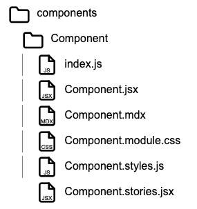

# 💡 edu-components-grading

## 👣 set up Component + Story + Styles

> This tutorial will scaffold a Styled Component together with Story, and style it. The purpose is to learn to always add module css, and CSS-inJS to every component.  
> To achieve the grade of yellow belt you need to complete this task in 4 minutes using only [`bash`](https://www.gnu.org/s/bash/manual/bash.html) and [`vim`](https://www.vim.org).
> No copy paste i allowed!
> Grading must be performed before a `black belt`.
>   
> 
>  
> ⚠️ **Notice**: You can use the `heredoc!` first time, but for grading you need to type it using Vim!
> ⚠️ **Notice**: You can use `heredoc` for Styled.module.css, it is not part of test!

### 📚 Instructions

#### 🦶 Scaffold Project

```bash
cd ~
cd ws
cd components-grading
mkdir -p ./src/components/Styled
touch ./src/components/Styled/index.js
touch ./src/components/Styled/Styled.jsx
touch ./src/components/Styled/Styled.module.css
touch ./src/components/Styled/Styled.styles.js
touch ./src/components/Styled/Styled.stories.jsx
```

#### 🦶 Component

```bash
cat > ./src/components/Styled/Styled.jsx << 'EOF'
import React from 'react';
import styles from './Styled.module.css';
import { dynamicStyles } from './Styled.styles.js';

const Styled = ({ text, fontSize }) => {

  if (typeof text !== 'string') {
    console.error("Invalid prop type: `text` should be a string.");
    return <div className={styles.errorText}>Invalid text prop provided!</div>;
  }

  const dynamicStyle = dynamicStyles(fontSize);

  return (
      <div className={styles.StyledContainer}>
        <div className={styles.StyledText} style={dynamicStyle.dynamicText}>
          Styled: {text}
        </div>
      </div>
  );
};

export default Styled;
EOF
```

#### 🦶 Barrel files

```bash
cat > ./src/components/Styled/index.js << 'EOF'
export {default as Styled} from './Styled';
EOF

cat >> ./src/components/index.js << 'EOF'
export {Styled} from './Styled';
EOF

cat >> ./src/index.js << 'EOF'
export {Styled} from './components';
EOF

```

#### 🦶 Storybook <heredoc
> Here we learn to write many stories to try to break Styled component.

```bash
cat > ./src/components/Styled/Styled.stories.jsx << 'EOF'
import React from 'react';
import {Styled} from '.';

export default {
  title: 'Components/Styled',
  component: Styled,
};

export const Default = {
  args: {
    text: "Hello, Storybook!",
    fontSize: 16,
  },
};

export const LargeText = {
  args: {
    text: "Large Font Text",
    fontSize: 24,
  },
};

export const InvalidProp = {
  args: {
    text: 123,
  },
};
EOF
```

#### 🦶 Module CSS

⚠️ **Notice**: You can use the `heredoc` CSS is not part of tutorial!

```bash
cat > ./src/components/Styled/Styled.module.css << 'EOF'
.StyledContainer {
    border: 2px solid gray;
    padding: 20px;
    border-radius: 5px;
    margin: 10px;
    display: inline-block;
}

.StyledText {
    color: blue;
    font-size: 16px;
    padding: 10px;
    border: 1px solid lightgray;
}

.errorText {
    color: red;
    border: 1px dashed red;
    padding: 5px;
    font-weight: bold;
}
EOF
```

#### 🦶 CSS-in-JS

```bash
cat > ./src/components/Styled/Styled.styles.js << 'EOF'
export const dynamicStyles = (fontSize) => ({
    dynamicText: {
        fontSize: fontSize ? `${fontSize}px` : '16px',
        transition: 'all 0.3s ease',
    },
});
EOF
```


---
---

## Bonus (not part of tutorial)

### Styled.mdx

```bash
cat > ./src/components/Styled/Styled.mdx << 'EOF'
import { Meta, Story, Canvas } from '@storybook/addon-docs/blocks';
import * as StyledStories from './Styled.stories'; // Import the stories

<Meta of={StyledStories} />

# Styled Component Documentation

## Overview
The `Styled` component demonstrates how to use **CSS Modules** and **CSS-in-JS** together in a React component. It applies scoped styles using a CSS Module for static styles and **CSS-in-JS** for dynamic styles based on props.

This component also includes **prop validation** using a **guard clause**. If the `text` prop is not a string, it logs an error to the console and displays an error message in the UI. This is useful for ensuring that the component behaves predictably and doesn't render incorrect content when invalid props are passed.

The component also **"talks"** to the user by visually communicating issues. Instead of silently failing, it renders an error message when an invalid prop is provided, improving the user experience. While `console.log` or `console.error` is helpful during development, it is recommended to replace them with more user-friendly error handling or feedback mechanisms in production.

### Why I Don't Use `Prop-Types` or TypeScript

In this project, I have opted not to use **`prop-types`** or **TypeScript** for a few reasons:

1. **Visual Components**:
The components here are primarily **visual** (focused on UI and styling), and the type validation or strict typing isn't always necessary for the design process. The focus is on **user interface** rather than **data management**.

2. **Storybook**:
**Storybook** serves as an effective tool for visualizing and testing components in isolation. It provides a robust interface for seeing how components behave with various props, so I don’t feel the need to enforce strict typing with TypeScript or `prop-types`. Storybook's interactive environment allows me to test how components react to different inputs quickly.

3. **CI/CD and Tests**:
The project relies on **CI/CD pipelines** that include **automated tests**, ensuring that the components behave as expected in all scenarios. I prefer to validate the behavior through tests rather than adding the additional complexity of TypeScript or `prop-types`. This way, I can write tests to check the behavior of components and ensure they function correctly.

4. **Simplicity Over Complexity**:
While `prop-types` and TypeScript are useful in many cases, I believe they introduce more **overhead** and **complexity** than benefit in this scenario. I prefer to keep the workflow simpler and focus on what matters most for UI components: **visual consistency** and **behavior** through testing and Storybook.

### Conclusion
By combining **Storybook**, **CI/CD** with tests, and a **simple error handling** approach, I can ensure that components are reliable and maintainable without the extra fuzz of TypeScript or `prop-types`. This approach helps me focus on **design** and **user experience** without getting bogged down by additional tooling and type-checking overhead.

## Code

```javascript
import React from 'react';
import styles from './Styled.module.css';
import { dynamicStyles } from './Styled.styles.js';

const Styled = ({ text, fontSize }) => {

  // Guard clause for invalid prop types
  if (typeof text !== 'string') {
    console.error("Invalid prop type: `text` should be a string.");
    return <div className={styles.errorText}>Invalid text prop provided!</div>;
  }

  // Dynamic styling based on the fontSize prop
  const dynamicStyle = dynamicStyles(fontSize);

  return (
    <div className={styles.StyledContainer}>
      <div className={styles.StyledText} style={dynamicStyle.dynamicText}>
        CSS Module + CSS-in-JS Styled: {text}
      </div>
    </div>
  );
};

export default Styled;
EOF
```

### info.mdx

```bash
cat > ./src/info.mdx <<
# Welcome to components-grading
## Orange belt

On this level, we will learn to style and protect a component.

Module CSS is a way to write scoped styles in CSS. It allows you to avoid global
namespace conflicts by ensuring that each component has its own isolated set of styles.
In a CSS Module, class names are automatically hashed to make them unique, preventing styling collisions across components.

CSS-in-JS refers to writing CSS directly inside your JavaScript code rather than in separate CSS files.
This approach allows you to create dynamic styles, based on JavaScript variables or props.

### File List:

- **index.js**
: It helps the bundler locate and load your components.

- **Component.mdx**
: The documentation file, which should describe the component’s functionality and usage.

- **Component.jsx**
: The component file, which should have a single responsibility and export the component by default for the bundler to locate.

- **Component.module.css**
: It is scoped to the component and uses its own namespace, preventing CSS collision.

- **Component.styles.js**
: It contains dynamic styles, *CSS-in-JS* and, while slower than .css, can offer more flexibility. It is typically used less frequently, but the file must exist for quality even when not used.

- **Component.stories.js**
: It contains test stories for your component, designed to test its robustness. If the component passes all tests without issues, it has succeeded.

**To grade yourself `Yellow Belt`, you should complete this task in 4 minutes using only Vim and a terminal.**. Grading must be performed before a `black belt`.
EOF
```

---
---

## 📋 You can clone and run this Tutorial from here

> ⚠️ **Warning**: This part is only if you start from here.

```bash
cd ~
[ -d ws ] && cd ws || { echo -e '\033[1;31mcreate workspace first!\033[0m'; return 1; }
rm -rf components-grading
git clone --single-branch --branch 2-Orange https://github.com/miwashi-edu/edu-components-grading.git components-grading
cd components-grading
rm -rf .git # Remove history
git init
git add .
git commit -m "Initial Commit"
npm install
```
```
